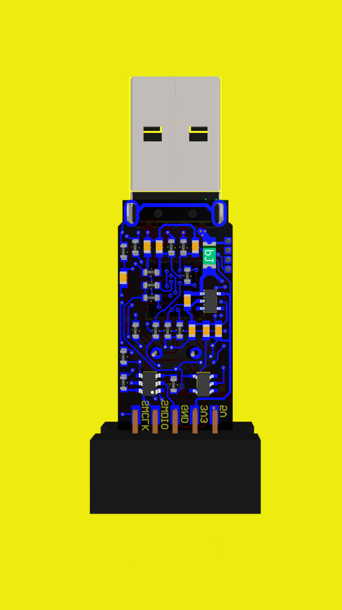

# STM32 ST-Link V2.0 Clone - Altium Designer Files

If you like **STM32-ST-Link-V2.0** - give it a star, or fork it and contribute!

This repository contains the open-source schematic and PCB design files for an ST-Link V2.0 clone, created using Altium Designer. This clone allows you to program and debug STM8 and STM32 microcontrollers.

## Schematic Diagram

## PCB Files

## Features

- Compatible with various STM8 and STM32 devices
- In-circuit debugging capabilities
- Based on the official ST-Link V2.0 design

## Requirements

- Altium Designer (or a compatible viewer)
- Bill of Materials (BOM) generation capabilities (optional)

## Screenshots :eyes:

<table>
  <tr>
    <th>
        
    </th>
    <th>
        
    </th>  
    <th>
        
    </th>
    <th>
        
    </th>
  </tr>
</table>

## Getting Started

1. **Download the repository**: Click "Clone or download" on the green button above.
2. **Open the project**: Use Altium Designer to open the `.PrjPCB` file located in the main directory.
3. **Review the schematics**: The `schematic.SchDoc` file shows the electrical connections and components used in the design.
4. **Examine the PCB layout**: The `PCB.PCBDoc` file represents the physical layout of the components on the printed circuit board.
5. **Generate BOM (optional)**: Use Altium Designer's BOM generation features to create a list of required components.

## Additional Information

- **Firmware**: This repository does not include the firmware. You'll need to obtain the official ST-Link V2.0 firmware from [link to official STMicroelectronics website] (replace with actual link).
- **Assembly instructions (optional)**: Consider adding a separate document or webpage with detailed instructions on soldering and assembling the PCB (if applicable).
- **License**: Specify the open-source license used for the design files (e.g., MIT License).

## Contributing

We encourage contributions to this project! Feel free to submit pull requests with improvements, bug fixes, or additional features.

## Disclaimer

This design is provided for educational purposes only. It is not guaranteed to be error-free, and you use it at your own risk.
